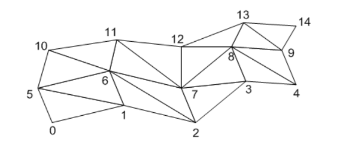

> 2018 - 08 - 02 study start

## Hoops Performance

아래의 코드는 **Hoops Visualiize** 에서 Rendering 성능을 빠르게 하기 위한 코드 이다.</br>
이 코드를 분석 해볼 가치가 있음.

```cs

				//view : HbaseView
                
                view.SetSuppressUpdate(true);
                
                view.SetDisplayListType(DisplayListType.DisplayListSegment);
                view.SetDisplayListMode(true);

		view.SetOcclusionCullingMode(false, true, 50);
                var oldStaticModel = view.GetModel().GetStaticModel();
            	if (m_bStaticModel != oldStaticModel)
            	{
                	view.GetModel().SetStaticModel(true);
            	}
                view.GetModel().SetLMVModel(true);
                
                var fakeColor = new HPoint(
                m_clrbtnFakeHLR.R / 255.0F,
                m_clrbtnFakeHLR.G / 255.0F,
                m_clrbtnFakeHLR.B / 255.0F
            	);
            	view.SetFakeHLRColor(fakeColor);
                
                view.SetSuppressUpdate(false);
                view.ExhaustiveUpdate(); //view.Update();
```

## Axis Triad가 위치가 계속 해서 고정 되는 이유

Rendering Option - screen range =(left, right, bottom, top)
resize 할 때 window coordinates 기준으로 위에 값을 설정 하면, segment를 해당 위치로 지정할 수 있다.
Sample Code : 아래의 코드를 활용해서 Screen Range 설정을 할 수 있다. 계속 해서 Color Legend의 위치를 고정 하기 위해서.
```cpp
	size = view->m_AxisWindowSize;

	HC_Open_Segment_By_Key(view->GetViewKey());
			w = view->m_XSize;
			h = view->m_YSize;		
		if(w > 0 && h > 0) {  // 5145
			HC_Open_Segment_By_Key(view->m_AxisTriadKey);
				char text[4096];
				/* 2.03125 to scale up the range 1/64th.  We scale the axis triad down 1/64th to make sure none of the
				 * letters are clipped. [#9800] */
				HCLOCALE(sprintf(text,"screen range=(%f, %f, %f, %f)",
					-1.0, -1.0 + 2.03125 * (float)size/(float)w, -1.0, -1.0 + 2.03125 * (float)size/(float)h));
				HC_Set_Rendering_Options (text);
			HC_Close_Segment();
		}
	HC_Close_Segment();
```

## Mesh 그리는 방법
> Insert_Mesh(int row, int column, float[] array)

```cpp
HC_Insert_Mesh(3, 5, point_array);
```
float array를 3 by 5 의 갯수에 맞게 만들어서 위의 함수를 호출 하면 3X5 의 Mesh가 만들어 지고</br>
대략적 으로 아래와 같은 모양이 된다.


