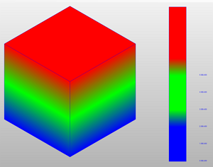

> 2018 - 08 - 02 study start

## Hoops Performance

아래의 코드는 **Hoops Visualiize** 에서 Rendering 성능을 빠르게 하기 위한 코드 이다.</br>
이 코드를 분석 해볼 가치가 있음.

```cs

				//view : HbaseView
                
                view.SetSuppressUpdate(true);
                
                view.SetDisplayListType(DisplayListType.DisplayListSegment);
                view.SetDisplayListMode(true);

		view.SetOcclusionCullingMode(false, true, 50);
                var oldStaticModel = view.GetModel().GetStaticModel();
            	if (m_bStaticModel != oldStaticModel)
            	{
                	view.GetModel().SetStaticModel(true);
            	}
                view.GetModel().SetLMVModel(true);
                
                var fakeColor = new HPoint(
                m_clrbtnFakeHLR.R / 255.0F,
                m_clrbtnFakeHLR.G / 255.0F,
                m_clrbtnFakeHLR.B / 255.0F
            	);
            	view.SetFakeHLRColor(fakeColor);
                
                view.SetSuppressUpdate(false);
                view.ExhaustiveUpdate(); //view.Update();
```

## Axis Triad가 위치가 계속 해서 고정 되는 이유

Rendering Option - screen range =(left, right, bottom, top)
resize 할 때 window coordinates 기준으로 위에 값을 설정 하면, segment를 해당 위치로 지정할 수 있다.
Sample Code : 아래의 코드를 활용해서 Screen Range 설정을 할 수 있다. 계속 해서 Color Legend의 위치를 고정 하기 위해서.
```cpp
	size = view->m_AxisWindowSize;

	HC_Open_Segment_By_Key(view->GetViewKey());
			w = view->m_XSize;
			h = view->m_YSize;		
		if(w > 0 && h > 0) {  // 5145
			HC_Open_Segment_By_Key(view->m_AxisTriadKey);
				char text[4096];
				/* 2.03125 to scale up the range 1/64th.  We scale the axis triad down 1/64th to make sure none of the
				 * letters are clipped. [#9800] */
				HCLOCALE(sprintf(text,"screen range=(%f, %f, %f, %f)",
					-1.0, -1.0 + 2.03125 * (float)size/(float)w, -1.0, -1.0 + 2.03125 * (float)size/(float)h));
				HC_Set_Rendering_Options (text);
			HC_Close_Segment();
		}
	HC_Close_Segment();
```

## Mesh 그리는 방법
> Insert_Mesh(int row, int column, float[] array)

```cpp
HC_Insert_Mesh(3, 5, point_array);
```
float array를 3 by 5 의 갯수에 맞게 만들어서 위의 함수를 호출 하면 3X5 의 Mesh가 만들어 지고</br>
대략적 으로 아래와 같은 모양이 된다.</br>


## Color Interpolation 설정(Color Map Index)
Mesh를 만든 다음, Mesh에 Vertex에 아래와 같이 Color index를 설정해 주면 Color Interpolation을 통한 효과를 얻을 수 있다.
아래의 샘플 소스를 보고 대략 적인 개념을 익힘.
```cpp
 var axisOffset = 0.45f;
            var posColor = new float[]
            {
                0.0f, 0.0f, 1.0f,
                0.0f, 1.0f, 0.0f,
                1.0f, 0.0f, 0.0f,
            };
            var posMesh = new float[20*3];
            for (var i = 0; i < 10; i++)
            {
                var lindex = i * 3;
                posMesh[lindex + 0] = 0.6f;
                posMesh[lindex + 1] = (float) i * 0.1f - axisOffset;
                posMesh[lindex + 2] = 0.0f;

                var rindex = (i + 10) * 3;
                posMesh[rindex + 0]  = 0.7f;
                posMesh[rindex + 1] = (float) i * 0.1f - axisOffset;// - 0.25f;
                posMesh[rindex + 2]  = 0.0f;
            }
            
            var pos = new[] {0.0f, 0.0f, 0.0f};
            var tar = new[] {0.0f, 0.0f, 1.0f};
            var up = new[] {0.0f, 1.0f, 0.0f};
            var width = 1.0f;
            var height = 1.0f;

            // Set Color Map
            HCS.Open_Segment_By_Key(_view.GetModelKey());
            {
                HCS.Open_Segment("color field");
                {
                    HCS.Set_Color_Map_By_Value("RGB", 3, posColor);
                    HCS.Set_Rendering_Options("color interpolation=on, color index interpolation=(faces, edges), no lighting");
                    HCS.Set_Visibility("everything=off, faces=on, edges=on, text=on, line=on");

                    HCS.Open_Segment("legend bar");
                    {
                        HCS.Set_Handedness("left");
                        HCS.Set_Camera(pos, tar, up, width, height, "orthographic");
                        HCS.Set_Visibility("edges=(everything=off,perimeters =on,interior silhouettes = on),faces = on");
                        HCS.Set_Visibility("light=off");
                        HCS.Insert_Distant_Light(0, 0, -1);
                        var meshkey = HCS.Insert_Mesh(2, 10, posMesh);
                        
                        HCS.Open_Geometry(meshkey);
                        int colorIndex = 0;
                        for (var i = 0; i < 10; i++)
                        {
                            if (0 <= i && i < 3)
                            {
                                colorIndex = 0;
                            }
                            else if (3 <= i && i < 6)
                            {
                                colorIndex = 1;
                            }
                            else
                            {
                                colorIndex = 2;
                            }

                            HCS.Open_Vertex(i);
                            {
                                HCS.Set_Color_By_FIndex("faces", colorIndex);
                            }
                            HCS.Close_Vertex();
                            HCS.Open_Vertex((i + 10));
                            {
                                HCS.Set_Color_By_FIndex("faces", colorIndex);
                            }
                            HCS.Close_Vertex();
                        }
                        HCS.Close_Geometry();

                        for (var i = 0; i < 6; i++)
                        {
                            //sprintf(sText, "%4.2E\n", radius *1.0f);
                            var sText = $"{(i * 1.0f):E2}";
                            HCS.Insert_Text(0.8f, i*0.1f - axisOffset, -0.1f, sText);
                        }
                    }
                    HCS.Close_Segment();

                    HCS.Open_Segment("shell");
                    {
                        var points = new float[]
                        {
                            -0.5f, -0.5f, -0.5f,
                            -0.5f, 0.5f, -0.5f,
                            0.5f, 0.5f, -0.5f,
                            0.5f, -0.5f, -0.5f,
                            -0.5f, -0.5f, 0.5f,
                            -0.5f, 0.5f, 0.5f,
                            0.5f, 0.5f, 0.5f,
                            0.5f, -0.5f, 0.5f,
                        };
                        points = points.Select(point => point * 10F).ToArray();
                        var face_list = new int[] 
                        {
                            4,0,1,2,3,
                            4,1,5,6,2,
                            4,5,4,7,6,
                            4,4,0,3,7,
                            4,3,2,6,7,
                            4,0,4,5,1
                        };
                        var keyShell = HCS.Insert_Shell(points.Length/3, points, face_list.Length, face_list);

                        var fValues = new float[]
                        {
                            0,0,0,0,2,2,2,2
                        };
                        HCS.MSet_Vertex_Colors_By_FIndex(keyShell, "faces", 0, fValues.Length, fValues);
                    }
                    HCS.Close_Segment();
                }
                HCS.Close_Segment();
            }
            HCS.Close_Segment();
```
Color Index를 적절히 사용해서 적용 하면 아래와 같은 화면을 얻을 수 있다.</br>



